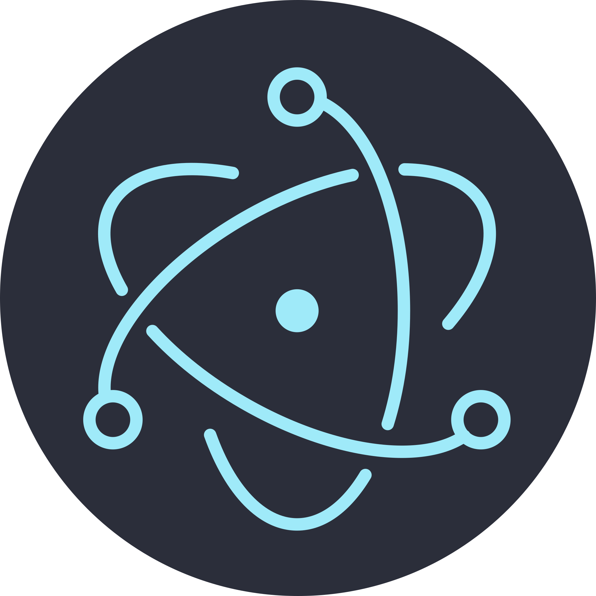
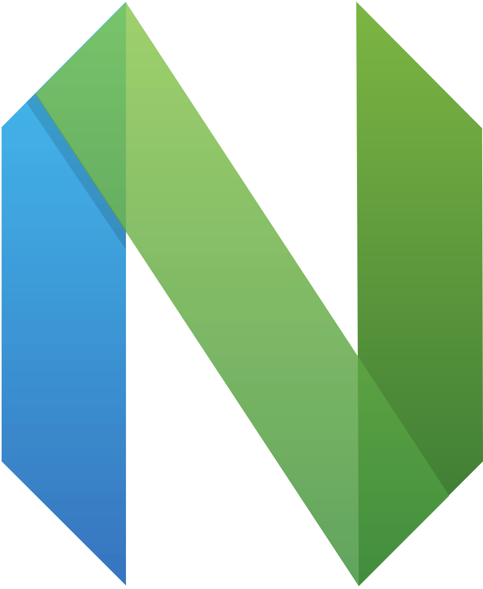

<!-- Description about me -->
<h2 align="center">  Who's this? 🤔  </h2>

Hey!  
I am Daniel Wales, better known as 'a-ww2-er'🕵🏼‍♂️  
I’m a software developer specializing in building cloud-native applications and services using Python, Node.js, and C# (.NET). As a full-stack web and mobile application developer, I bring ideas to life with clean, efficient, and maintainable code (somewhat..). 

With expertise in both SQL and NoSQL databases and multiple cloud platforms, I design solutions tailored to modern software needs. My passion lies in cloud-native development, DevOps practices, and creating systems that can scale seamlessly. 

If you are interested in a guy with a good vibe who loves the knowledge and the constant learning 📚, <b>⚙️I AM YOUR GUY⚙️</b>  

Let’s collaborate! Whether it’s a new project, an innovative idea, or a technical challenge, <b>Reach out</b> 📨—I’d love to hear from you!
   

### More About Me:
 
🔭 I’m currently studying  
🤝 I’m looking to collaborate on Open Source Projects 
👨🏻‍💻 Most of my projects are available on [Github](https://github.com/a-ww2-er?tab=repositories) 
💬 Ask me about anything tech related, I am happy to help (if you have questions with linux you can ask me🐧); 
📫 Feel free to contact me on [discord](relichk) 
🎷 When I am free, I like to model 3d characters and animate 
P.S > <b>I use arch btw...</b>
 
   

<!-- languajes and skills section -->

<h1 align="center"> Languages/Frameworks I'm good at: </h1>

  <code></code>
  <code></code>
  <code></code>
  <code></code>
  <code></code>
  <code></code>
  <code></code>
  <code></code>
  <code></code>
  <code></code>
  <code></code>
  <code></code>
  <code></code>
  <code></code>
  <code></code>
  <code></code>
  <code></code>
  <code></code>
  <code></code>
  <code></code>

 

<h1 align="center"> Cloud Tools I Work With: </h1>

  <code></code>
  <code></code>
  <code></code>
  <code></code>
  <code></code>
  <code></code>
  <code></code>
  <code></code>
    <code></code>

 

<h1 align="center"> Environments I Work In: </h1>

  <code></code>
  <code></code>
  <code></code>
  <code></code>
  <code></code>
  <code></code>

 

 

<!-- last refresh of readme section -->

Last refresh: <b>Tuesday, February 13, 7:15 AM GMT-5</b>

<!---
DavidsDvm/DavidsDvm is a ✨ special ✨ repository because its `README.md` (this file) appears on your GitHub profile.
You can click the Preview link to take a look at your changes.
--->
