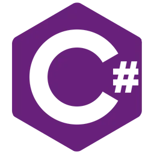

<!-- 
GIF SECTION

If you wanna know how i made this gif

I made this with my repo: (https://github.com/DavidsDvm/GitHub_ProfileReadmeGIF)
There i made and page with the GIF content, later i record my screen with OBS
after that i converter the video from mp4 to gif
ur welcome ;) 
-->
<!-- -->

<!-- Social icons section -->
<!-- <h1 align="center"> Social Media: </h1>
  

    
    
    
    
  

</h1> -->

<!-- Description about me -->
<h2 align="center"> 🤔 About me 👨‍💻 </h2>

Hey!!!  
I am Daniel Wales better known as 'a-ww2-er'🕵🏼‍♂️  
I specialize in creating bots with Python and Node.js ,developing applications with C# and .NET, and crafting websites and mobile apps. 
Proficient in SQL and NoSQL databases, I focus on cloud computing, DevOps, and designing scalable solutions for modern software development 
If you are interested in a guy with a good vibe who loves the knowledge and the constant learning 📚, <b>⚙️I AM YOUR GUY⚙️</b>  
Contact me for new projects 📨, I am open to collaborate with you
   

<!-- Bogota's weather table -->

<!-- <h2 align="center"> 🇨🇴 Bogota's Weather ⛅ </h2>
<table align="center" style="width:50%">
    <tr style="text-align:center">
        <th>Weather</th>
        <th>Temperature</th>
        <th>Sunrise</th>
        <th>Sunset</th>
        <th>Humidity</th>
    </tr>
    <tr style="text-align:center">
        <td><b>fog</b></td>
        <td><b>8°C</b></td>
        <td><b>06:11 AM</b></td>
        <td><b>06:09 PM</b></td>
        <td><b>100%</b></td>
    </tr>
</table> -->

### 🧐 More About Me:
 
🔭 I’m currently studying  
🤝 I’m looking to collaborate on Open Source Projects 
👨🏻‍💻 Most of my projects are available on [Github](https://github.com/a-ww2-er?tab=repositories) 
💬 Ask me about anything tech related, I am happy to help (if you have questions with linux you can ask me🐧); 
📫 Feel free to contact me on [discord](illneas.) 
🎷 When I am free, I like to model 3d characters and animate 
 
   

<!-- languajes and skills section -->

<h1 align="center"> Languages/Frameworks I'm good at: </h1>

  <code></code>
  <code></code>
  <code></code>
  <code></code>
  <code></code>
  <code></code>
  <code></code>
  <code></code>
  <code></code>
  <code></code>
  <code></code>
  <code></code>
  <code></code>
  <code></code>
  <code></code>
  <code></code>
  <code></code>
  <code></code>
  <code></code>
  <code></code>
  <code></code>

 

<h1 align="center"> Cloud Tools I Work With: </h1>

  <code></code>
  <code></code>
  <code></code>
  <code></code>
  <code></code>
  <code></code>
  <code></code>
  <code></code>

 

<h1 align="center"> Environments I Work With: </h1>

  <code></code>
  <code></code>
  <code></code>
  <code></code>
  <code></code>
  <code></code>

 

 

<!-- last refresh of readme section -->

Last refresh: <b>Tuesday, February 13, 7:15 AM GMT-5</b>

<!---
DavidsDvm/DavidsDvm is a ✨ special ✨ repository because its `README.md` (this file) appears on your GitHub profile.
You can click the Preview link to take a look at your changes.
--->
